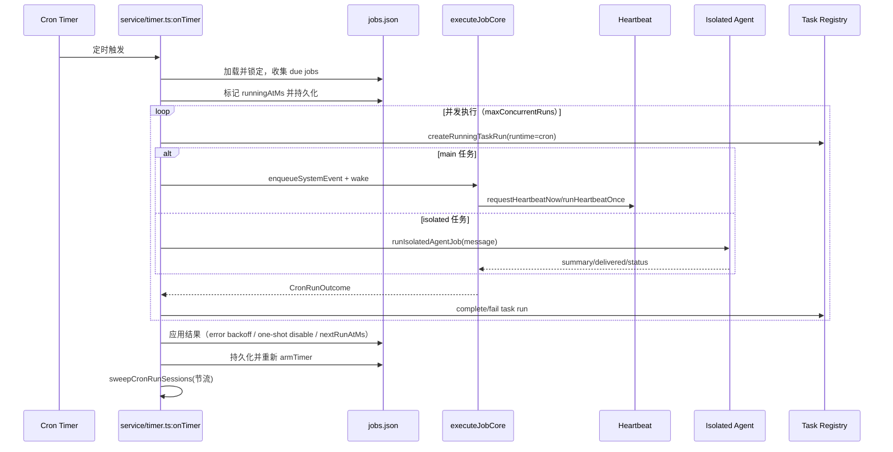

# 定时任务实现深度分析（Cron + Heartbeat + Tasks）

> 本文基于当前仓库源码，对 OpenClaw 的“定时任务能力”做工程级解构。这里的定时任务不是单点模块，而是 **Cron 调度器 + Heartbeat 唤醒层 + Task 台账/维护层** 的组合系统。

## 1. 总体结论（先给结论）

OpenClaw 的定时任务采用“三层解耦 + 两套执行路径 + 一套可观测台账”方案：

1. **调度层（CronService）**：负责持久化任务、计算下一次触发、定时器驱动、并发控制、重启补偿与异常退避。核心在 `src/cron/service/*` 与 `src/cron/schedule.ts`。
2. **执行层（Main / Isolated）**：
   - Main 任务通过 `enqueueSystemEvent + heartbeat` 进入主会话语义；
   - Isolated 任务通过 `runIsolatedAgentJob` 在独立会话执行并做投递。
3. **治理层（Tasks Registry）**：每次 cron 执行都会落入任务台账（task run），并由维护器做 reconcile、lost 判定与清理，保证“运行态”和“记录态”一致。

这套设计的关键优势是：**调度与执行解耦、失败可恢复、状态可追踪、重启不丢任务、并发可控**。

---

## 2. 核心模块划分

### 2.1 CronService 门面与状态容器

- `CronService` 是门面，`start/list/add/run/...` 都委托到 `service/ops.ts`，自身只做薄封装。
- 运行时状态包含：`store`、`timer`、`running`、`op`（串行链）、`storeLoadedAtMs` 等。
- 依赖注入项包括：`enqueueSystemEvent`、`requestHeartbeatNow`、`runHeartbeatOnce`、`runIsolatedAgentJob`、`sendCronFailureAlert`。

这意味着 CronService **不直接绑定具体网关实现**，通过依赖注入对接 Gateway/CLI 运行环境。

### 2.2 持久化与恢复：jobs.json + 备份策略

- 默认存储：`~/.openclaw/cron/jobs.json`（由 `resolveCronStorePath` 解析）。
- 保存采用“临时文件 + rename”策略，并对 `EBUSY/EPERM/EEXIST` 做兼容处理。
- 仅运行态字段（如 `state`、`updatedAtMs`）变化时可跳过备份，减少无意义 I/O。

这体现了典型的 **配置数据原子写 + 兼容文件系统差异** 设计。

### 2.3 调度算法：at / every / cron 三种模式

- `at`：一次性时间点。
- `every`：固定间隔（支持 `anchorMs`，并按 lastRun 推导下一次）。
- `cron`：由 `croner` 解析表达式 + 时区。

此外，项目对 cron 做了两层增强：

1. **缓存 Cron 对象**（减少重复解析）；
2. **stagger 稳定偏移**：基于 jobId 哈希计算 offset，让同类任务错峰执行，避免“整点风暴”。

### 2.4 定时器引擎与并发控制

- `armTimer()` 选择最近 `nextWakeAtMs`，并设置上限 60s 的重检周期。
- 如果调度器正在运行（`state.running=true`），不会停摆，而是设置 recheck timer 防止“长任务期间调度死亡”。
- `onTimer()` 内部先在锁内收集 due job，再在锁外并发执行，再回锁内应用结果并持久化。
- 并发度由 `cronConfig.maxConcurrentRuns` 控制，最小为 1。

这是典型的 **锁内最小化 + 锁外执行 + 结果回写** 模式，兼顾一致性与吞吐。

### 2.5 执行路径：Main 与 Isolated

- **Main session 任务**：通常要求 `payload.kind=systemEvent`，通过 `enqueueSystemEvent` 写入系统事件，再按 `wakeMode` 触发 heartbeat（now 或 next-heartbeat）。
- **Isolated / current / session:\* 任务**：要求 `payload.kind=agentTurn`，由 `runIsolatedAgentJob` 执行，可配置 announce/webhook 等投递。

该约束在创建/更新任务时显式校验，避免“错误 payload + 错误 sessionTarget”的隐性混配。

### 2.6 失败策略与退避

- 连续错误计数 `consecutiveErrors`。
- 一次性任务（`at`）支持瞬态错误重试（默认最多 3 次，带 backoff），超过后禁用。
- 周期任务错误后应用 backoff，并确保下一次触发不早于下界，避免自旋。
- 对 cron 模式额外加 `MIN_REFIRE_GAP_MS` 防护，避免同秒反复触发。
- 支持 failure alert（阈值 + 冷却），并支持 webhook/announce 通道。

### 2.7 重启补偿与过期任务处理

- 启动时会清理 stale `runningAtMs`。
- `runMissedJobs()` 在重启后补跑遗漏任务，并支持 `maxMissedJobsPerRestart` 与 `missedJobStaggerMs` 做节流。
- 维护型 recompute 与执行型 recompute 分离：避免“只读 list/status 就把 past-due 任务推进到未来”导致漏跑。

这是调度器稳定性的关键：**不因观测行为改变执行语义**。

### 2.8 Heartbeat 与 Cron 的关系

Heartbeat 本身也是“定时驱动”，但定位不同：

- Heartbeat 负责周期性唤醒 agent（支持 active hours、lane busy 检查、coalesce/retry）；
- Cron 负责“任务定义级调度”。

两者通过 `requestHeartbeatNow` / `runHeartbeatOnce` 在网关层汇合：Cron 可触发 heartbeat，heartbeat 也会处理 cron 相关系统事件。

### 2.9 Tasks 台账与维护

- Cron 每次运行都会创建 task run（runtime=`cron`）。
- 运行成功/失败后更新 task terminal 状态。
- 后台维护会对 active task 做 reconcile：
  - cron 任务是否仍由 `active-jobs` 持有；
  - 超过 grace 且无 backing runtime 时标记为 `lost`；
  - 终态任务按 retention 清理。

这使得运维端（`openclaw tasks ...`）能看到可信状态，而不是“调度器日志孤岛”。

---

## 3. Mermaid 架构图（组件关系）

```mermaid
flowchart LR
    U[User / CLI / API] --> C[CronService Facade]
    C --> OPS[service/ops.ts]
    OPS --> LOCK[locked() 串行链]
    OPS --> ST[(jobs.json Store)]
    OPS --> TMR[service/timer.ts]

    TMR --> SCH[schedule.ts\n(at/every/cron + tz + stagger)]
    TMR --> EXE{执行路径}

    EXE -->|sessionTarget=main| MAIN[enqueueSystemEvent]
    MAIN --> HBW[heartbeat-wake.ts]
    HBW --> HBR[heartbeat-runner.ts]

    EXE -->|sessionTarget=isolated/current/session:*| ISO[runIsolatedAgentJob]
    ISO --> DLV[delivery plan / announce / webhook]

    TMR --> TASK[task-executor.ts\ncreate/complete/fail task run]
    TASK --> REG[(tasks/runs.sqlite)]

    TMR --> REAPER[session-reaper.ts\ncron run session 清理]

    subgraph Gateway Integration
      GSC[src/gateway/server-cron.ts]
    end
    GSC --> C
```

---

## 4. Mermaid 时序图（一次 cron 到执行完成）



---

## 5. 设计亮点与工程权衡

### 5.1 亮点

- **强一致写路径**：关键状态更新都在锁内完成，并持久化后再释放。
- **高可恢复性**：重启补偿、stale running 清理、missed jobs 补跑。
- **防抖与防风暴**：stagger + backoff + min refire gap + timer clamp。
- **可观测性完善**：事件、run log、task ledger、audit/maintenance。

### 5.2 权衡

- 锁串行保证了安全，但在极高 job 数量下会增加调度管理开销。
- cron 与 heartbeat 双系统并存，灵活但认知成本更高。
- 存储为文件（jobs.json）便于本地部署，但多进程协同时依赖锁与 reload 语义。

---

## 6. 如果要继续演进，我建议的方向

1. **调度元数据可视化**：在 `/status` 或 Web UI 暴露 nextRunAt、error backoff 阶段、stagger offset。
2. **任务组级限流**：除全局并发外，增加按 agent/sessionTarget 的并发配额。
3. **运行态指标化**：输出 Prometheus 风格 metrics（due lag、run duration p95、missed catch-up counts）。
4. **策略插件化**：将 retry/failure-alert 策略进一步抽象为可配置 policy profile。

---

## 7. 快速定位源码（阅读顺序）

建议按下面顺序阅读：

1. `src/cron/service.ts`（门面）
2. `src/cron/service/ops.ts`（生命周期 + CRUD + run 入口）
3. `src/cron/service/timer.ts`（调度主循环、并发、结果回写）
4. `src/cron/service/jobs.ts`（nextRun、规则校验、状态推进）
5. `src/cron/schedule.ts`（at/every/cron 计算）
6. `src/gateway/server-cron.ts`（与 heartbeat/isolated/delivery 的实际接线）
7. `src/tasks/task-executor.ts` + `src/tasks/task-registry.maintenance.ts`（台账与治理）
8. `src/infra/heartbeat-wake.ts` + `src/infra/heartbeat-runner.ts`（唤醒/执行机制）
